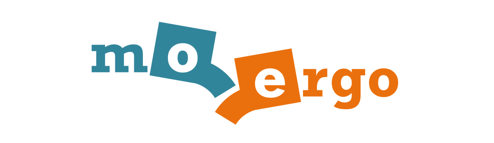

# MoErgo Glove80 - ZMK를 활용한 한국어 속기사 키보드 만들기



이 저장소는 **MoErgo Glove80** 무선 분할 컨투어 키보드를 기반으로, 한국어 *스테노(Steno) 키보드([CAS방식](https://plover.wiki/index.php/Steno_layouts_and_supported_languages#Korean_CAS))*, 즉 속기사 키보드 레이어를 추가한 레포지토리입니다.

Steno_Korean 레이어는 `Layer 2`에 위치해 있습니다.
기본 레이어들에 Steno_Korean 레이어만 추가하였습니다.(해당 레이어(`Layer 2`)는 `lower` 레이어를 통해 바꿀 수 있습니다.) 

**ZMK 펌웨어**에 대해 잘 아시는 고급 사용자는 직접 `clone`을 받으셔서 편집하시면 되지만, **Glove80** 키보드 특성상 **MoErgo**에서 제공하는 [웹 편집기](https://my.glove80.com/#/layout/user/a14b5c8e-8335-4506-b7b1-add15baa4d4f)에서 편집하시는 것을 추천합니다.
(**MoErgo**에서도 권장하는 사항이고, *스테노 키보드*를 만드는데 충분한 기능을 제공하고 있으며, 보다 빠릅니다.)

## 빌드 방법
추천하지는 않지만 **ZMK 펌웨어**를 직접 빌드하시고 싶으시다면 아래의 방법을 참고하시면 됩니다.
(Windows 환경에서만 테스트를 진행하였습니다.)

### *Docker*를 사용하여 빌드하는 방법
1. *Docker Desktop* 앱을 열고 실행합니다.
2. `Dockerfile`이 있는 `./firmware/docker`에 가서 아래 명령어를 실행 합니다.

```powershell
docker build -t glove80-zmk .
```

3. 그리고 아래 커맨드로 빌드를 실행합니다.
```powershell
./build.bat
```

4. 빌드가 완료되면 프로젝트 루트 경로에 `glove80.uf2` 파일이 생성됩니다. `.uf2` 파일을 **Glove80** 키보드에 복사하여 적용하시면 됩니다.

빌드 되는데 시간이 오래 걸리기 때문에 **MoErgo**에서 제공하는 [웹 편집기](https://my.glove80.com/#/layout/user/a14b5c8e-8335-4506-b7b1-add15baa4d4f)를 사용하는 것을 추천합니다.

[사이트](https://my.glove80.com/#/layout/user/a14b5c8e-8335-4506-b7b1-add15baa4d4f)에 들어가시면 원 클릭으로 빠르게 빌드할 수 있습니다.

## Plover 설치 및 사용
[Plover](https://www.openstenoproject.org/plover/)은 무료 오픈소스 속기 엔진입니다.

[Plover 사이트](https://www.openstenoproject.org/plover/)에서 다운로드 할 수 있습니다.

##### `plover_korean` 플러그인 설치 및 사용
한국어용 속기 엔진을 사용하기 위해서는 [plover_korean](https://github.com/nsmarkop/plover_korean) 플러그인을 설치하셔야 합니다.
설치는 **Plover** 앱을 실행하신 뒤 **Plugins Manager**에서 설치하시는 게 좋습니다.


**plover_korean** 플러그인을 설치하시면 [**Korean Modern C - CAS-based System**](https://github.com/nsmarkop/plover_korean?tab=readme-ov-file#korean-modern-c)를 사용할 수 있습니다.

또한 [**Meta Plugins**](https://github.com/nsmarkop/plover_korean?tab=readme-ov-file#meta-plugins)를 사용할 수 있어 매우 매력적인 플러그인이라고 할 수 있을 것 같습니다.

또 다른 한국어 플러그인으로는 [**easy_korean_steno**](https://github.com/petercpark/easy_korean_steno) 플러그인도 대안이 수 있다고 생각합니다.(이 플러그인은 [유퀴즈에 나왔던 피터박](https://www.youtube.com/watch?v=HBGjw-k7i6E&t=1002s)님께서 만드신 걸로 추정 됩니다.)

[**easy_korean_steno**](https://github.com/petercpark/easy_korean_steno) 플러그인은 한 글자를 한 번에 만드는데 초점을 둔 걸로 알고 있습니다.
[데모영상](https://www.youtube.com/watch?v=MfRnoFWqE-E)에서도 볼 수 있듯이 한 단어, 한 문장 단위가 아닌 한 글자 씩 만들기 때문에 스피드 면에서 조금 떨어질 수밖에 없을 것 같습니다.

플러그인이 모두 설치 됐다면 이제 연습을 하시면 됩니다.
연습을 할 수 있는 사이트는 아래 남겨 놓겠습니다.
([한국속기원(연습 페이지)](https://www.koreasteno.com/cas/), 일부 유료화가 있기는 하지만 연습할 수 있는 프로그램이 있다는 점과 자료가 비교적 많다는 점에서 CAS(plover_korean) 방식이 현재까지는 가장 좋은 대안이지 않을까 생각됩니다.)

---

## 리소스
- [공식 모에르고 Glove80 지원](https://moergo.com/glove80-support) 웹 사이트. Glove80 문서 및 기타 기술 자료.
- [공식 모에르고 디스코드 서버](https://moergo.com/discord). 다른 Glove80 사용자와의 즉각적인 대화.
- [공식 ZMK 문서](https://zmk.dev/docs) 웹 사이트. ZMK 펌웨어에 대한 많은 질문에 대한 답을 찾을 수 있습니다.
- [공식 ZMK 디스코드 서버](https://discord.gg/8cfMkQksSB). 다른 ZMK 개발자 및 사용자와 즉시 대화할 수 있습니다. 훌륭한 기술 리소스!
- [공식 글로브80 ZMK 배포](https://github.com/moergo-sc/zmk). Glove80에 맞게 커스터마이징된 ZMK 펌웨어 저장소.

